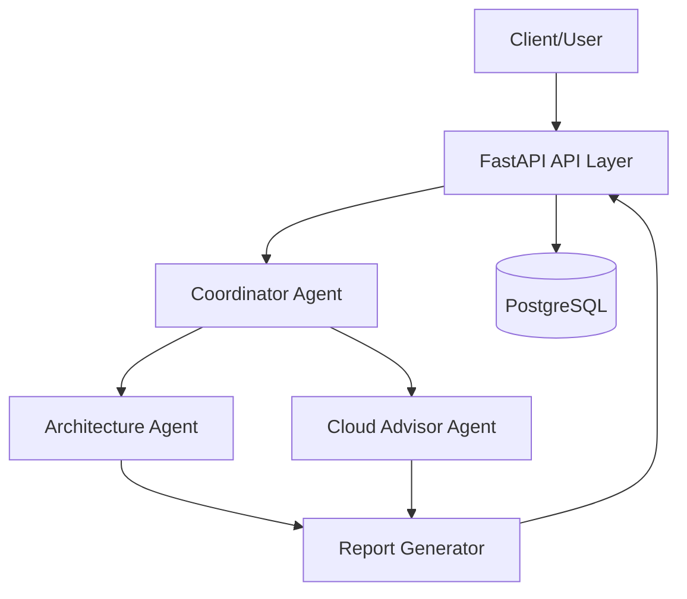

# Northstack Architecture

# High-Level Architecture

---

# Components

## API Layer

Responsible for:
- receiving requests
- validating schemas
- orchestrating services
- returning structured responses

Built with:
- FastAPI
- Pydantic

---

# Coordinator Agent

Main orchestration agent.

Responsibilities:
- understand project context
- delegate specialized analysis
- combine outputs
- produce final architecture summary

---

# Architecture Agent

Responsible for:
- backend structure recommendations
- database suggestions
- scalability analysis
- system design recommendations

---

# Cloud Advisor Agent

Responsible for:
- cloud provider suggestions
- AWS service recommendations
- infrastructure simplification
- cost-awareness

---

# Report Generator

Responsible for:
- generating markdown reports
- generating Mermaid diagrams
- formatting outputs

---

# Database

Initial database:
- PostgreSQL

Purpose:
- request history
- generated reports
- architecture persistence

---

# Future Components

Potential future additions:
- Redis
- Vector database
- RAG pipelines
- Cost estimation engine
- Architecture validator
- Observability

---

# Initial Deployment Strategy

Development:
- Docker Compose
- OrbStack

Production later:
- ECS/Fargate
- Railway
- Render
- Fly.io

---

# Scalability Philosophy

The project should initially behave as a:
- modular monolith

Avoid:
- microservices
- distributed complexity
- premature scaling patterns

The architecture may evolve later if necessary.
