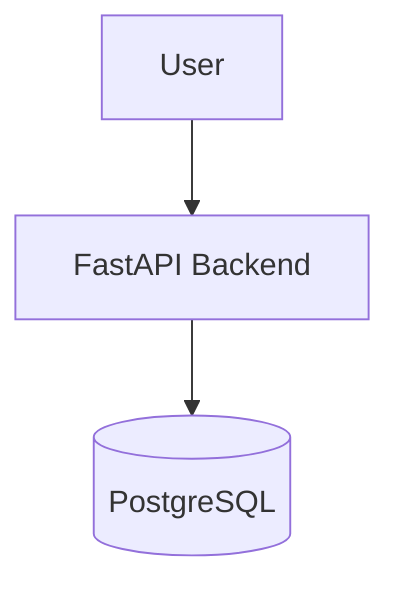

# Northstack — Development Context

This document exists to provide complete architectural and engineering context for both human developers and AI coding assistants such as Cursor, Codex and ChatGPT.

All generated code should follow the principles and constraints defined here.

---

# Project Identity

Northstack is an AI-powered software architecture planning platform.

The system transforms raw project ideas into:
- technical architecture plans
- stack recommendations
- cloud suggestions
- engineering roadmaps
- architecture diagrams
- implementation strategies

The project is NOT:
- a generic chatbot
- a toy LLM wrapper
- a random multi-agent experiment

Northstack should feel like a real engineering platform.

---

# Main Goal

The purpose of this project is to help developers design software systems before implementation.

The system should help users answer:
- Which stack should I use?
- Should I use monolith or microservices?
- Do I need Redis?
- Should I use AWS services?
- How should I structure my backend?
- What is the MVP architecture?
- How can this scale later?

---

# Engineering Philosophy

The project prioritizes:
- clean architecture
- maintainability
- modularity
- practical engineering
- realistic infrastructure
- low complexity initially
- iterative growth

Avoid:
- unnecessary abstractions
- premature optimization
- fake enterprise complexity
- overengineered workflows
- excessive agent orchestration

---

# Architecture Philosophy

Northstack should:
- prefer simple solutions first
- evolve incrementally
- generate realistic architectures
- explain engineering tradeoffs
- avoid recommending unnecessary infrastructure

The AI should behave like a senior software architect.

---

# Preferred Stack

## Backend
- Python
- FastAPI

## Agent Framework
- Agno

## Database
- PostgreSQL

## Infrastructure
- Docker
- Docker Compose
- OrbStack

## AI Provider
- OpenAI API

---

# Initial Scope

The MVP should:
- receive a project idea
- analyze requirements
- generate architecture suggestions
- generate Mermaid diagrams
- return structured JSON responses
- generate markdown reports

The MVP should NOT:
- implement authentication yet
- implement billing
- implement frontend
- implement distributed systems
- implement Kubernetes
- implement advanced observability

---

# Folder Structure

```txt
northstack/
│
├── app/
│   ├── api/
│   ├── agents/
│   ├── services/
│   ├── prompts/
│   ├── schemas/
│   ├── core/
│   └── main.py
│
├── reports/
├── docs/
├── tests/
├── Dockerfile
├── docker-compose.yml
├── README.md
├── CONTEXT.md
├── ROADMAP.md
└── ARCHITECTURE.md
```

---

# Agent Strategy

The project should begin with FEW agents.

Avoid creating many agents initially.

Recommended initial architecture:

- CoordinatorAgent
- ArchitectureAgent
- CloudAdvisorAgent

Optional future agents:
- SecurityAgent
- CostEstimationAgent
- ScalingAgent
- DevOpsAdvisorAgent

---

# API Philosophy

The API should:
- be simple
- use typed schemas
- use Pydantic
- return structured outputs
- be predictable
- avoid deeply nested responses

---

# Coding Standards

## Python
- Use type hints
- Use Pydantic models
- Keep functions small
- Prefer composition over inheritance
- Avoid large files

## FastAPI
- Separate routes/services/schemas
- Keep endpoints thin
- Move business logic to services

## Docker
- Keep images lightweight
- Prefer reproducible builds
- Use environment variables
- Never hardcode secrets

---

# AI Assistant Instructions

When generating code:
- prioritize readability
- prioritize maintainability
- avoid unnecessary abstractions
- avoid overengineering
- explain important decisions
- keep architecture modular

When uncertain:
- prefer simpler implementations

Do NOT:
- create unnecessary microservices
- create unnecessary async workflows
- introduce complex patterns too early

---

# Mermaid Diagram Rules

All architecture diagrams should:
- be readable
- represent realistic systems
- avoid excessive complexity
- use clear naming

Preferred diagram style:



---

# Future Vision

Future versions may include:
- architecture validation
- cloud cost estimation
- architecture comparison
- RAG over engineering documentation
- AWS integrations
- exportable reports
- frontend dashboard
- architecture scoring

---

# Important Principle

Northstack is an engineering tool first.

AI is an implementation detail.

The project should feel like:
- a serious developer platform
- an architecture assistant
- a software engineering copilot
